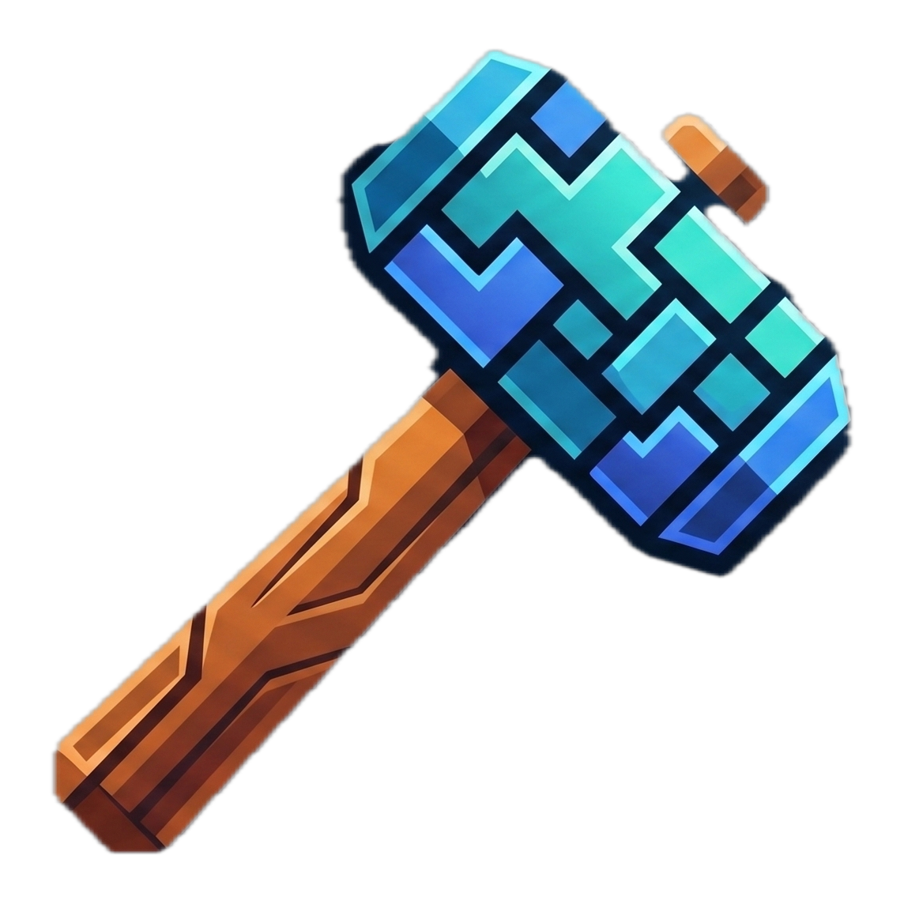

<div align="center">



# FeedForge

### Product descriptions that sell — forged by AI

**Bulk‑generate SEO‑optimized e‑commerce product descriptions with _your own_ AI key.**
Import a CSV, forge hundreds of descriptions in one click, export. You pay only for your own usage — nothing is marked up, nothing is stored.

<br/>


</div>


<div align="center">

<video src="public/the%20video.mp4" width="720" controls muted></video>

[Watch the video](public/the%20video.mp4)

</div>

---

##  Why FeedForge?

Writing product copy by hand doesn't scale. Existing AI tools fix that but they wrap the AI in a markup, lock you to one model, and route your catalog through their servers.

**FeedForge flips the model.** You bring your own API key, so:

- **No markup** — you pay the provider's wholesale token price, nothing more.
- **No data lock‑in** — keys and catalog data live in your browser, sent to the server only for the split second a request runs, never stored.
- **No model lock‑in** — switch between Claude, OpenAI, Gemini and OpenRouter at will.
- **No surprise bills** — a live usage dashboard shows tokens and estimated cost as you go.

---

## 🚀 Features

| | |
|---|---|
|  **Bulk generation** | Import a CSV catalog and forge hundreds of descriptions in one click. |
|  **Bring Your Own Key (BYOK)** | Plug in your own key for **Claude · OpenAI · Gemini · OpenRouter**. |
|  **Brand voice** | Describe your tone once; every description matches it. |
| **SEO‑first copy** | Persuasive, keyword‑aware descriptions — no filler, no fluff. |
|  **Live usage dashboard** | Animated counters for descriptions, tokens and estimated cost, with a per‑day chart. |
| **CSV in / CSV out** | Edit results inline, then export a clean CSV ready for your store. |
| **Tech‑glass UI** | A dark "Forge" theme with glassmorphism and forge‑sweep animations. |


---

##  Tech stack

- **Framework** — [Next.js 16](https://nextjs.org/) (App Router) + [React 19](https://react.dev/)
- **Language** — TypeScript
- **Styling** — Tailwind CSS 4, custom glassmorphism + keyframe animations
- **Fonts** — Space Grotesk (display) · Inter (interface)
- **AI** — [`@anthropic-ai/sdk`](https://www.npmjs.com/package/@anthropic-ai/sdk) for Claude · [`openai`](https://www.npmjs.com/package/openai) SDK for OpenAI / Gemini / OpenRouter (OpenAI‑compatible)
- **CSV** — PapaParse
- **Runtime / package manager** — [Bun](https://bun.sh/)

---

##  Getting started

```bash
# 1. Install dependencies
bun install

# 2. Start the dev server
bun run dev
```

Open **http://localhost:3000**, then:

1. Go to **Settings** → pick a provider → paste your API key → choose a model.
2. Go to **Generate** → add products (or drag & drop a CSV) → **Generate all**.
3. Check **Usage** to watch tokens and estimated cost update live.

> **You need a valid API key with credit** from your chosen provider. A single description costs a fraction of a cent on the cheapest models.


---

## 🗺️ Roadmap

- [ ] Authentication + subscription billing (Stripe)
- [ ] Native Shopify / WooCommerce integration
- [ ] Multi‑language description output
- [ ] Niche presets (jewelry, wine, cosmetics, …)
- [ ] Live provider pricing (instead of static estimates)

---

## 📄 License

Personal project all rights reserved. Feel free to explore the code.

<div align="center">
<br/>
Built with "forge" &nbsp;by Matmar Lysa
</div>
